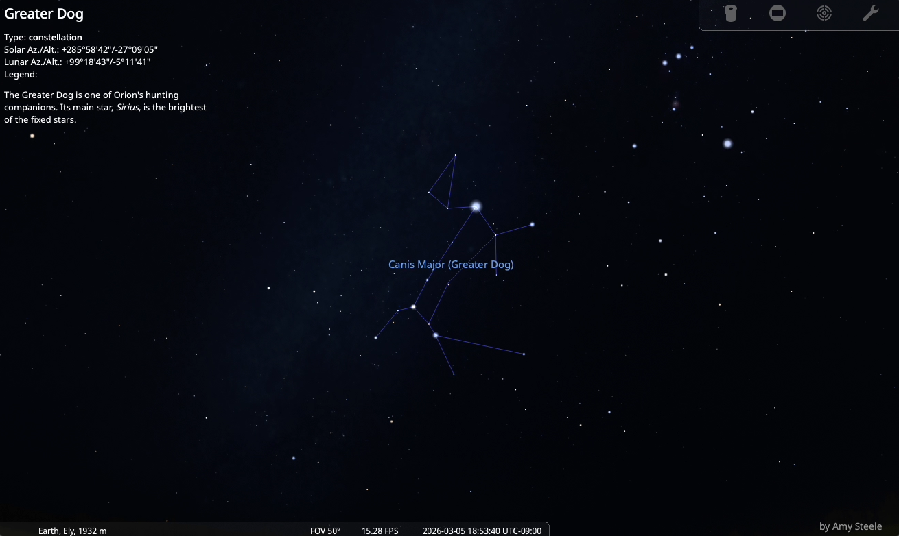

# stellarium_scripts

These are scripts to create smooth demonstrations of the night sky.

- 📍 Location: Ely, Nevada  
- 📅 Date: March 5, 2026  
- 🌌 Focus: Major winter and spring constellations  
- ⭐ March Highlights: 
Andromeda, M31 / Taurus, Pleaides /Auriga, IC 410 / 
Gemini, Jupiter / Orion, M42 / Canis Minor, Procyon / 
Canis Major, Sirius / Leo, M66 / Ursa Major, M101 / 
Draco, NGC 5906 / Ursa Minor, Polaris / Cassiopeia, IC 1805

The script was used to generate the video below via macOS screen capture.

## 🎥 Screen Caputured Tour

## How to Run

1. Open Stellarium (v25.4 recommended)
2. Open Script Console (Function + F12 on mac)
3. Load `march_ely.ssc`
4. Run
